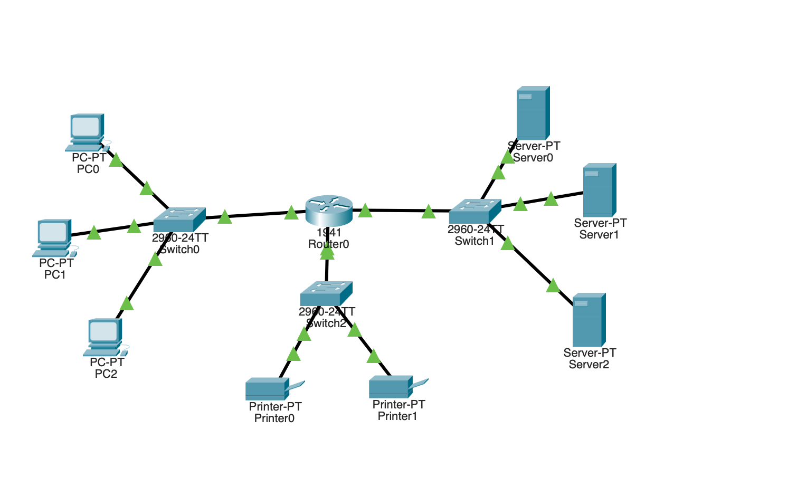

# Lab 02: Network Segmentation with VLSM

## Overview
This lab demonstrates the implementation of **Variable Length Subnet Masking (VLSM)** to segment a single `192.168.1.0/24` network into three functional subnets.

## Topology

## Subnet Table
| Department | Network ID | Gateway | Usable Range | Broadcast |
| :--- | :--- | :--- | :--- | :--- |
| **PCs** | .0 | .1 | .2 - .62 | .63 |
| **Servers** | .64 | .65 | .66 - .126 | .127 |
| **Printers** | .128 | .129 | .130 - .190 | .191 |

## Key Technical Challenges
- **L2/L3 Hybrid Connectivity:** Used the `HWIC-4ESW` expansion module.
- **SVI Configuration:** Since the module is Layer 2, I configured a **Switched Virtual Interface (VLAN 1)** on the router to act as the gateway for the printer subnet.
- **Verification:** Successfully performed inter-subnet pings between all three wings.
